# Low Battery Recovery Mode (for solar users)

> **Disclosure**: This feature was developed with AI assistance (Claude) and is presented here for community discussion, testing, and review.

Basically, I am using this on my solar nodes, and anybody who wants it can pull it into their own if you're experiencing issues with solar nodes just dying and not recovering. If it makes it into the Develop branch I'll also be happy, since the current mechanism is quite broken.

## Why This Feature?

When the battery drains completely overnight or during cloudy periods, the node shuts down and it won't automatically recover when the sunlight returns. The owner must physically visit the node to restart it.

This feature solves that by entering an ultra-low-power "recovery sleep" mode that periodically wakes to check if power has been restored. This is specifically targeted for the LoraV3 device from Heltec, but can be configured easily for other devices.

## ELI5

Imagine your node is like a hibernating bear:

 **Before**: When the battery got too low, the bear went to sleep forever and never woke up, even when spring came.

 **After**: Now when the battery gets low, the bear takes short naps (5 minutes), briefly opens one eye to check "is it spring yet?", and if the sun is shining (battery charging), it wakes up fully!

 **USB Smart**: If you plug in a USB cable and it's actually charging, the bear stays awake. But if the battery keeps dropping despite USB being connected (weak solar, bad cable), the bear goes to sleep anyway - USB isn't helping!

 **Button Wake**: Even while napping, the bear keeps one ear open. If you poke the bear, it wakes up immediately - even if it's starving! No battery check, no questions asked.

## Currently Enabled For

| Device               | Status               |
| -------------------- | -------------------- |
| **Heltec LoRa32 V4** |  Enabled           |
| **T-Beam S3 Core**   |  Enabled           |
| All other devices    |  Disabled (opt-in) |

## Comparison: Existing vs. New Behavior

### The Problem with Existing Deep Sleep

The existing Meshtastic firmware has a critical limitation for solar-powered nodes:

```cpp
// In Default.h
#define default_sds_secs IF_ROUTER(ONE_DAY, UINT32_MAX)
```

For **non-router nodes**, `sds_secs` defaults to `UINT32_MAX` (4.3 billion milliseconds = **136 years**). When battery hits critical levels, the node sleeps essentially forever - even if solar fully recharges the battery, the node stays asleep until manually reset.

### Side-by-Side Comparison

| Aspect                | **Existing Behavior**              | **New Recovery Mode**               |
| --------------------- | ---------------------------------- | ----------------------------------- |
| **Trigger**           | Voltage < 3.1V (~0%)               | ≤10% (no USB) or ≤5% (with USB)     |
| **Sleep Duration**    | Forever (non-router) or 24h        | 5 minutes                           |
| **Wake Sources**      | Timer (if set), button             | Timer + button                      |
| **On Wake**           | Full boot → check → maybe sleep    | Quick ADC check → sleep or boot     |
| **Power on Wake**     | ~50mA for full boot (~3-5 sec)     | ~35mA for ~100ms                    |
| **USB Detection**     | Only after full boot               | Early boot GPIO/voltage check       |
| **Auto Recovery**     |  No (sleeps forever)             |  Yes (checks every 5 min)         |
| **Daily Power (low)** | ~0 mAh (sleeping) or ~70mAh        | ~40 mAh                             |

### Visual Comparison

```
EXISTING (non-router):
  Battery 0% → Deep Sleep FOREVER → [needs manual reset]
                      ↓
                Solar charges battery to 100%
                      ↓
                Still sleeping... 💀

NEW RECOVERY MODE:
  Battery 10% → Sleep 5min → Wake → Check
                                ↓
                          Still low? → Sleep 5min (repeat)
                                ↓
                          Recovered (≥15%)? → Normal boot! 
```

### When to Use Which

**Existing behavior** (disable this feature) if:
- Maximum battery conservation is critical
- Node is easily accessible for manual reset
- No solar or external charging expected

**New recovery mode** (enable this feature) if:
- Solar-powered remote deployment
- Node is in a hard-to-reach location
- Automatic recovery is more important than marginal power savings
- Intermittent power situations (cloudy days, weak solar)

## How It Works

### Decision Flow - Runtime Detection

```mermaid
flowchart TD
    A[Normal Operation] --> B{Battery Check}
    B --> C{USB + Charging?}
    C -->|Yes| A
    C -->|No| D{USB Connected?}
    D -->|Yes| E{Battery ≤ 5%?}
    D -->|No| F{Battery ≤ 10%?}
    E -->|No| A
    E -->|Yes| G[Enter Recovery]
    F -->|No| A
    F -->|Yes| G
    G --> H[Deep Sleep 5 min]
```



### Decision Flow - Wake Check

```mermaid
flowchart TD
    I[Deep Sleep] --> J[Wake Up]
    J --> K{Wake Cause?}
    K -->|Button| L[Exit Recovery]
    L --> M[Normal Boot]
    K -->|Timer| N{USB Connected?}
    N -->|Yes| O{Battery > 5%?}
    O -->|Yes| L
    O -->|No| I
    N -->|No| P{Battery ≥ 15%?}
    P -->|Yes| L
    P -->|No| I
```



### Wake Sources

The device can wake from recovery sleep via:

| Wake Source     | Power Cost | Response Time | Use Case                     |
| --------------- | ---------- | ------------- | ---------------------------- |
| **Timer**       | ~0 µA      | Every 5 min   | Automatic power check        |
| **Button Press** | ~0 µA      | Instant       | Manual override/maintenance  |

### State Diagram

```mermaid
flowchart TB
    subgraph NORMAL["🟢 NORMAL OPERATION"]
        N[Running]
        Check{Low Battery?}
    end

    subgraph RECOVERY["🔴 RECOVERY MODE"]
        Sleep["💤 Deep Sleep<br/>~10-20µA<br/>5 min timer"]
        Wake{Wake Check}
    end

    N -->|monitoring| Check
    Check -->|"No USB + >10%"| N
    Check -->|"USB + >5%"| N
    Check -->|"No USB + ≤10%"| Sleep
    Check -->|"USB + ≤5%"| Sleep
    
    Sleep -->|timer/button| Wake
    
    Wake -->|"USB + >5%"| N
    Wake -->|"No USB + ≥15%"| N
    Wake -->|Button pressed| N
    Wake -->|Still low| Sleep
```



**Threshold summary:**
| Condition | Enter Sleep | Wake Up |
|-----------|-------------|---------|
| **No USB** | ≤10% | ≥15% |
| **USB connected** | ≤5% | >5% |
| **Button press** | - | Always |

## Power Consumption Analysis

> **Note**: Power figures below are from manufacturer datasheets. Actual measurements may vary by board.

### Reference Documents

| Component | Document | Key Spec |
|-----------|----------|----------|
| ESP32-S3 | [ESP32-S3 Technical Reference Manual](https://www.espressif.com/sites/default/files/documentation/esp32-s3_technical_reference_manual_en.pdf) | Deep sleep: 7-10 µA |
| ESP32 | [ESP-IDF Low Power Mode Guide](https://docs.espressif.com/projects/esp-idf/en/latest/esp32/api-guides/low-power-mode/low-power-mode-soc.html) | Deep sleep w/RTC: ~10 µA |
| SX1262 | [SX1262 Datasheet (Semtech)](https://www.semtech.com/products/wireless-rf/lora-connect/sx1262) | Sleep: 160 nA - 600 nA |

### Recovery Mode Power Draw (per datasheet)

| State        | Current   | Duration per Cycle | Source |
| ------------ | --------- | ------------------ | ------ |
| Deep Sleep   | ~10 µA | ~5 minutes | ESP32-S3 TRM Table 1-1 |
| SX1262 Sleep | ~0.6 µA | ~5 minutes | SX1262 Datasheet |
| Wake & Check | ~30-50 mA | ~100-200 ms | ESP32-S3 TRM (CPU active @ 240MHz) |

### Battery Life in Recovery Mode

**With a 3000mAh battery entering recovery at 10%:**

```
Remaining capacity at 10%: ~300 mAh

Per Hour (theoretical):
  - Deep sleep: 60 min × 0.010 mA = 0.6 mAh
  - Wake cycles: 12 × 0.15s × 40mA = 0.072 mAh × 12 = 0.86 mAh
  - Total: ~1.5 mAh/hour

Daily: ~36 mAh/day
Recovery survival time: 300 mAh ÷ 36 mAh/day ≈ 8 days
```

This gives a solar panel **~8 days** of cloudy weather to provide enough charge to reach 15% and resume normal operation.

### Comparison Table (starting from 10% / 300mAh remaining)

| Mode                             | Current Draw | Survival Time  | Source |
| -------------------------------- | ------------ | -------------- | ------ |
| **Active mesh operation**        | 50-100+ mA   | 3-6 hours      | ESP32 + SX1262 datasheets (CPU + LoRa TX) |
| **Light sleep**                  | 5-10 mA      | 30-60 hours    | ESP-IDF docs |
| **Recovery mode (this feature)** | ~1.5 mAh/hr  | **~8 days**    | Calculated from datasheet |
| **Full shutdown**                | ~5 µA        | ~7 years       | ESP32 hibernation mode |

## Configuration

### Default Thresholds

| Setting                      | Default   | Description                                       |
| ---------------------------- | --------- | ------------------------------------------------- |
| `LOW_BATT_ENTER_THRESHOLD`   | 10%       | Enter recovery when no USB (sleep at ≤10%)        |
| `LOW_BATT_EXIT_THRESHOLD`    | 15%       | Exit recovery when no USB (wake at ≥15%)          |
| `LOW_BATT_USB_THRESHOLD`     | 5%        | With USB: sleep at ≤5%, wake at >5%               |
| `LOW_BATT_SLEEP_INTERVAL_MS` | 5 minutes | Time between wake checks                          |

### Customizing for Your Variant

Add to your `variant.h`:

```cpp
// Enable the feature
#define LOW_BATTERY_RECOVERY_ENABLED

// Optional: customize thresholds
#define LOW_BATT_ENTER_THRESHOLD 15      // No USB: enter at 15% instead of 10%
#define LOW_BATT_EXIT_THRESHOLD 20       // No USB: exit at 20% instead of 15%
#define LOW_BATT_USB_THRESHOLD 8         // With USB: sleep/wake at 8% instead of 5%
#define LOW_BATT_SLEEP_INTERVAL_MS (10 * 60 * 1000)  // 10 minutes instead of 5
```

## Enabling for Other Devices

To enable this feature for any ESP32-based variant:

1. Open the variant's `variant.h` file (e.g., `variants/esp32s3/your-device/variant.h`)
2. Add at the top of the file:
   ```cpp
   #define LOW_BATTERY_RECOVERY_ENABLED
   ```
3. Rebuild the firmware

### Requirements

- **ESP32 architecture** (ESP32, ESP32-S3, ESP32-C3, etc.)
- **For early boot battery check** (recommended):
  - `BATTERY_PIN` defined in variant.h
  - `ADC_MULTIPLIER` defined in variant.h (board-specific value)
  - Uses shared `OCV_ARRAY` from `power.h` (no duplicate tables)
- **Alternative**: PMU (AXP192/AXP2101) for battery monitoring (partial support)

> **Why ADC_MULTIPLIER is required**: Different boards have different voltage divider ratios. Using a hardcoded default would cause incorrect readings and potential deadlock. If your variant doesn't define `ADC_MULTIPLIER`, the early boot check is skipped and the device boots normally (fail-safe).

### Device-Specific Notes

| Device Type                   | Early Boot Check | USB Detection    | Notes                                     |
| ----------------------------- | ---------------- | ---------------- | ----------------------------------------- |
| **Direct ADC** (Heltec, etc.) | ✅ Full support  | Voltage-based    | Requires `BATTERY_PIN` + `ADC_MULTIPLIER` |
| **PMU-based** (T-Beam, etc.)  | ⚠️ Partial       | PMU `isVbusIn()` | Does brief normal boot to check via I2C   |
| **With EXT_PWR_DETECT**       | ✅ Full support  | Direct GPIO      | Fastest USB detection                     |
| **Missing ADC_MULTIPLIER**    | ❌ Disabled      | N/A              | Skips early check, does normal boot       |

## Safety Features

### USB Power Detection

| Check               | Method                              | Result                          |
| ------------------- | ----------------------------------- | ------------------------------- |
| **Direct GPIO**     | `EXT_PWR_DETECT` pin (if available) | Immediate USB detection at boot |
| **Charging status** | PMU `isCharging()` flag             | Confirms active charging        |

### Insufficient USB Power Detection

The firmware uses a simple rule: **if battery drops to ≤10% despite USB being connected, USB isn't providing enough power**.

This handles scenarios like:

- Small solar panel on a cloudy day
- Weak USB power bank
- Long/thin USB cables with voltage drop

When detected, the node enters recovery mode rather than draining the battery while "pretending" to be powered. On wake, if USB is still connected and battery has recovered above 5%, the node will resume normal operation.

### Other Protections

1. **ADC sanity check**: If voltage reading is outside LiPo range (2.5-4.5V), assumes bad reading and forces normal boot
2. **ADC_MULTIPLIER required**: Won't attempt early battery check unless variant defines ADC_MULTIPLIER (prevents wrong readings)
3. **USB + above threshold**: If USB connected and battery > 5%, stays awake / exits recovery
4. **Battery threshold**: If battery ≥ 15% (no USB), exits recovery
5. **Fallback behavior**: If battery can't be read, assumes OK and continues normal boot
6. **Hysteresis**: Different thresholds for USB vs no-USB prevents rapid cycling
7. **USB bypass**: If USB is connected AND actively charging, low battery check is skipped entirely
8. **Button wake**: Physical button press **always** exits recovery mode, even at 0% battery (manual override)


## 🤝 Attestations

- [x] I have tested that my proposed changes behave as described.
- [x] I have tested that my proposed changes do not cause any obvious regressions on the following devices:
  - [x] Heltec (Lora32) V4
  - [ ] LilyGo T-Deck
  - [x] LilyGo T-Beam
  - [ ] RAK WisBlock 4631
  - [ ] Seeed Studio T-1000E tracker card
  - [ ] Other (please specify below)
